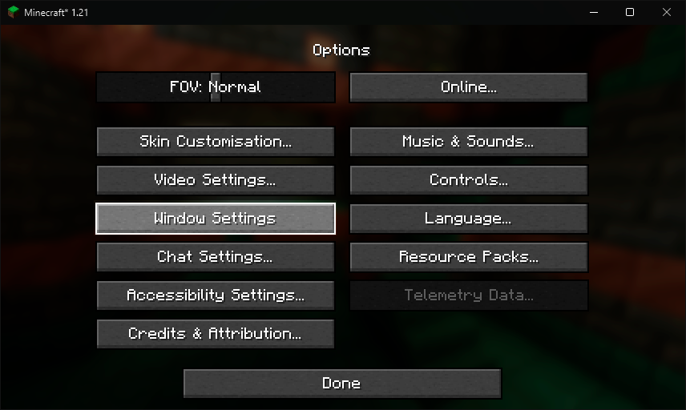
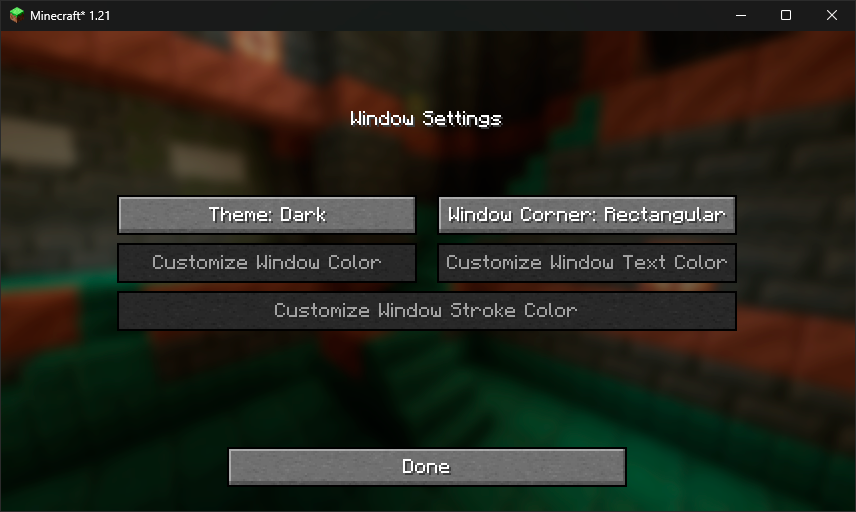
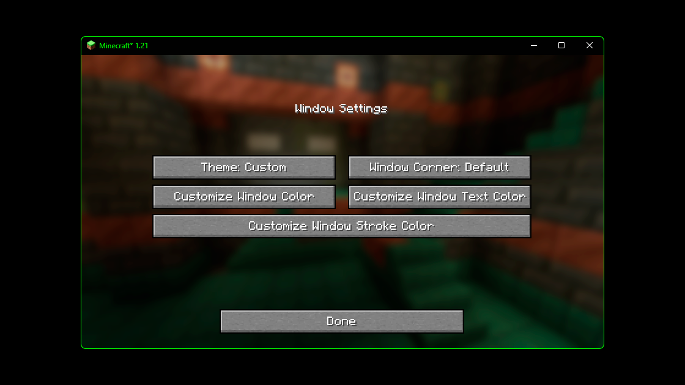
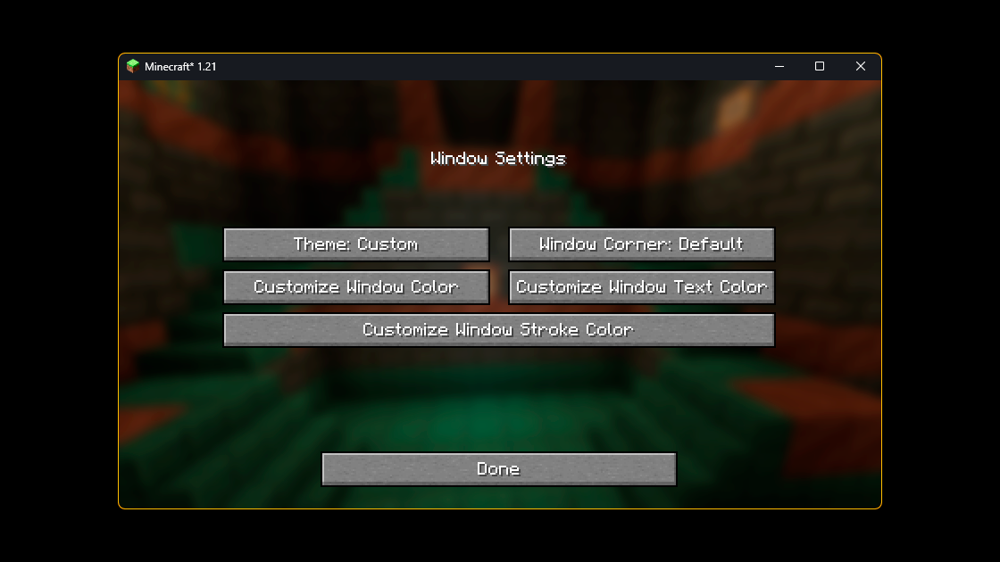
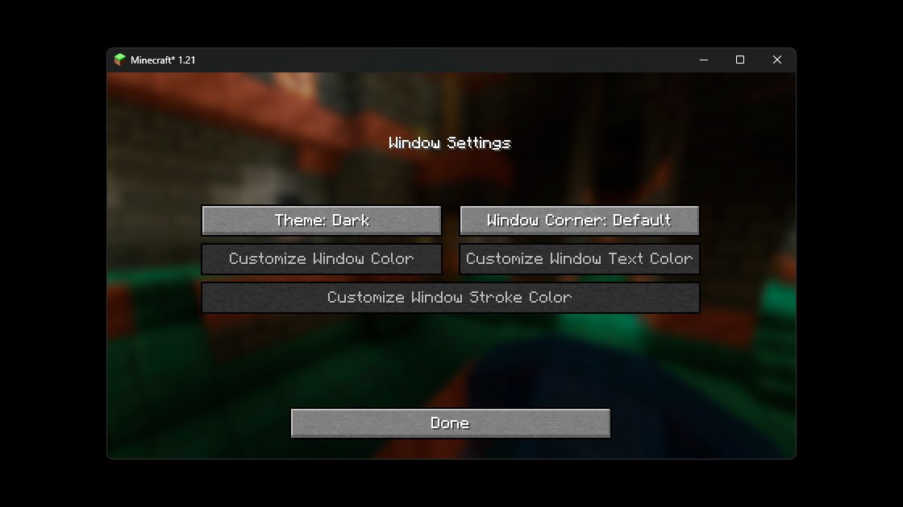

# Titlebar Changer

**Titlebar Changer** is a mod for Minecraft that allows you to customize the appearance of the window titlebar, including colors, text, and borders. Full functionality of the mod is available only on Windows 11; on Windows 10, features are limited to changing the titlebar color to dark.

## Download and Additional Information

You can download the mod from [Modrinth](https://modrinth.com/project/titlebar-changer). There, you will also find additional information and updates.

## Main Features
- **Change Window Titlebar Color**: Full customization is available only on Windows 11.
- **Set Titlebar Color**: On Windows 10, you can only change the titlebar color to dark.

## How to Configure the Mod

1. **Open the Settings Menu**: Access the mod settings menu through the Minecraft interface.

   

2. **Configure Colors**: In the settings menu, you can select colors for the window titlebar, title, and borders. Choose your desired colors from the palette.

   

## Color Change Examples

Here are a few examples of changing the window titlebar colors:





## Configuration File

The mod uses a configuration file that allows you to manually set colors. The configuration file is located in the `config/` directory and is named `titlebar_settings.json`. Here is an example of the file content:

```json
{
  "theme": 1,
  "corner": 1,
  "titleBarColor": {
    "r": 5,
    "g": 5,
    "b": 5
  },
  "titleBarTextColor": {
    "r": 0,
    "g": 255,
    "b": 0
  },
  "titleBarStrokeColor": {
    "r": 0,
    "g": 255,
    "b": 0
  },
  "showTheMenu": true,
  "showWarnScreen": true
}
```

- **theme**: Titlebar theme. Available values:
  - `0`: Light
  - `1`: Dark
  - `2`: Custom (only in this theme can you customize colors).
- **corner**: Window corner style. Available values:
  - `0`: Rectangular
  - `1`: Default
  - `2`: Semi-Rounded
- **titleBarColor**: Titlebar color (RGB). Customizable only in the custom theme.
- **titleBarTextColor**: Title text color (RGB). Customizable only in the custom theme.
- **titleBarStrokeColor**: Titlebar border color (RGB). Customizable only in the custom theme.
- **showTheMenu**: Show the settings menu. If you are a pack creator and do not want users to edit the window in-game, you can disable the menu in the settings.
- **showWarnScreen**: Show warning screen. If the system is not suitable for the mod, the mod will display a warning. After the first warning, the mod will automatically set this to `false`, but you can disable the warning entirely.